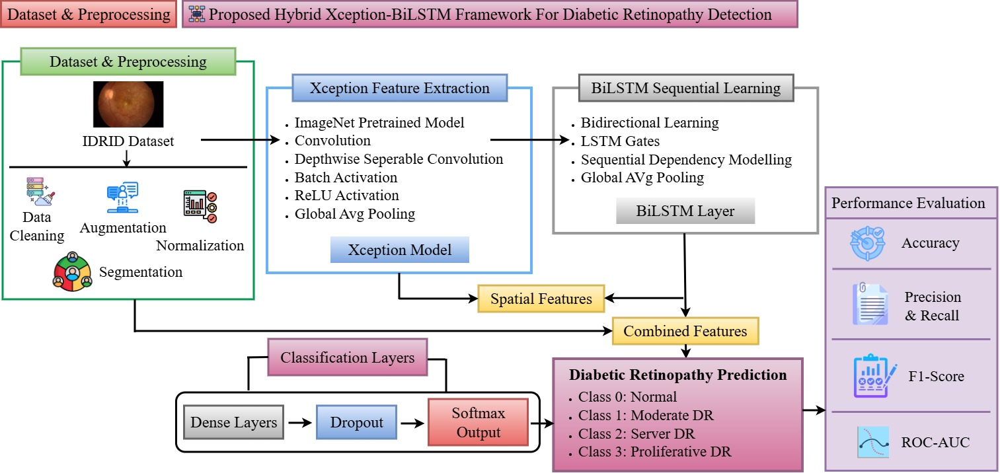
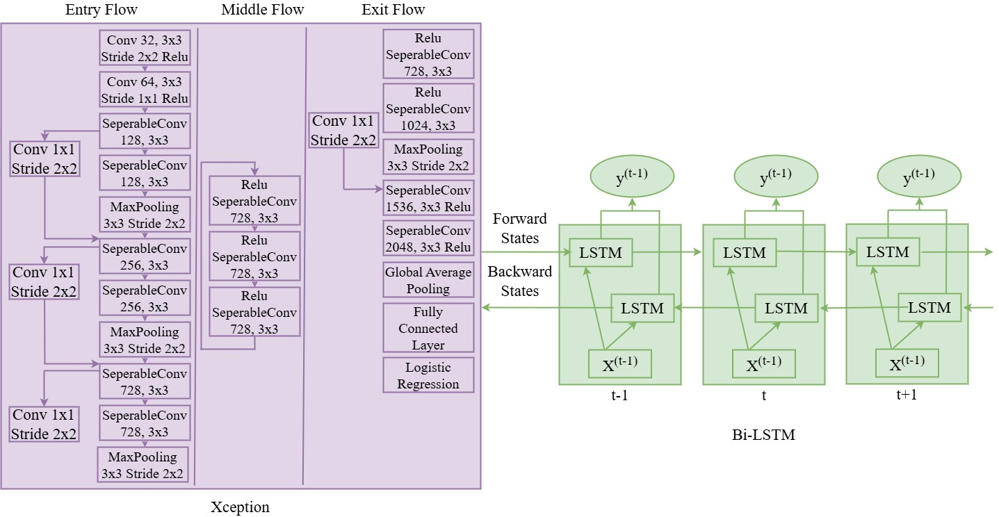
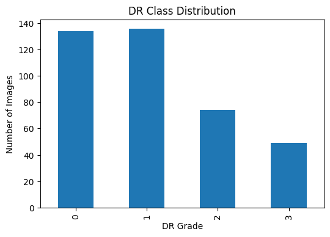
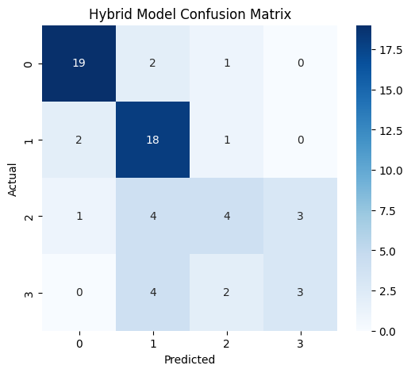
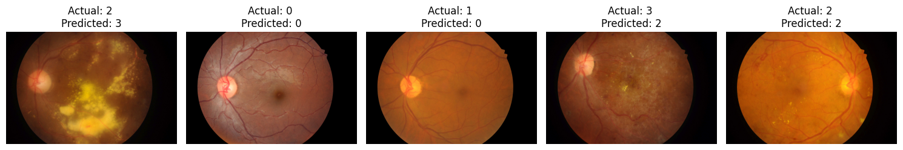

# Advanced Hybrid Deep Learning Approach for Early Detection of Diabetic Retinopathy

## Project Overview

This project presents an end-to-end deep learning pipeline for the early detection and classification of diabetic retinopathy using retinal fundus images. Diabetic retinopathy is a diabetes-related eye disease that damages the blood vessels in the retina and can lead to vision loss if it is not detected and treated at an early stage.

Manual screening of retinal images is time-consuming, requires trained ophthalmologists, and can be difficult to scale for large populations. To support faster and more consistent screening, this project develops a hybrid deep learning model using Xception and BiLSTM.

The proposed model uses Xception for spatial feature extraction from retinal fundus images and BiLSTM for sequential and contextual feature learning. The final classification layer predicts diabetic retinopathy severity classes from retinal fundus images.

---

## Problem Statement

Diabetic retinopathy detection is an important medical image classification problem. Existing diabetic retinopathy detection systems mainly use traditional machine learning or CNN-based deep learning models.

Traditional machine learning approaches depend heavily on handcrafted features such as texture, morphology, and histogram-based features. These methods can be useful, but they may not generalize well across different image qualities and clinical environments.

CNN-based deep learning models can automatically extract spatial features from retinal images. However, many CNN models mainly focus on spatial patterns and may not fully capture contextual relationships between lesion features across different severity stages.

This project addresses this limitation by combining:

* Xception for efficient spatial feature extraction
* BiLSTM for sequential and contextual feature learning
* Softmax classification for diabetic retinopathy severity prediction

The main goal is to build an automated diabetic retinopathy detection system that can support early screening and reduce manual workload.

---

## Research Aim

The aim of this project is to develop a hybrid Xception–BiLSTM deep learning model for diabetic retinopathy classification using retinal fundus images.

The model is designed to improve classification reliability by combining spatial feature extraction with sequential contextual learning.

---

## Research Objectives

The main objectives of this project are:

1. To preprocess retinal fundus images for deep learning-based classification.
2. To handle class imbalance by removing a highly underrepresented class and relabelling the remaining classes.
3. To apply image augmentation to improve model generalization.
4. To develop a hybrid Xception–BiLSTM model for diabetic retinopathy detection.
5. To evaluate the model using accuracy, precision, recall, F1-score, confusion matrix, and AUC score.
6. To analyse prediction results and identify limitations for future improvement.

---

## Proposed Hybrid Framework

The proposed framework includes dataset preprocessing, Xception-based spatial feature extraction, BiLSTM-based sequential learning, classification layers, diabetic retinopathy prediction, and performance evaluation.



---

## Model Architecture

The model combines Xception and BiLSTM in a hybrid deep learning architecture.

Xception is used as the base feature extractor because it applies depthwise separable convolutions, which help extract strong spatial features with reduced computational complexity. The extracted feature maps are reshaped into sequential format and passed into a Bidirectional LSTM layer.

BiLSTM learns contextual relationships from both forward and backward directions. This helps the model capture feature dependencies that may be useful for diabetic retinopathy severity classification.



---

## Dataset

This project uses the Indian Diabetic Retinopathy Image Dataset, commonly known as IDRiD.

Dataset source:

https://ieee-dataport.org/open-access/indian-diabetic-retinopathy-image-dataset-idrid

The dataset contains retinal fundus images with diabetic retinopathy severity labels. The original dataset contains multiple diabetic retinopathy grades. Due to class imbalance, one highly underrepresented class was removed, and the remaining classes were relabelled into four classes for model training.

The raw dataset is not included in this repository due to dataset size and usage restrictions. To reproduce this project, download the dataset from the official source and update the dataset path in the notebook.

### Final Class Distribution

| New Class Label | Original Grade | Number of Images |
| --------------- | -------------: | ---------------: |
| Class 0         |        Grade 0 |              134 |
| Class 1         |        Grade 2 |              136 |
| Class 2         |        Grade 3 |               74 |
| Class 3         |        Grade 4 |               49 |

---

## Class Distribution

The class distribution chart shows the final diabetic retinopathy class balance after preprocessing and relabelling.



---

## Tools and Technologies

The following tools and technologies were used in this project:

* Python
* Google Colab
* TensorFlow
* Keras
* Xception
* BiLSTM
* OpenCV
* NumPy
* Pandas
* Matplotlib
* Seaborn
* Scikit-learn
* Jupyter Notebook

---

## Project Workflow

The project follows a complete deep learning workflow:

1. Dataset loading
2. Image path configuration
3. Label preprocessing
4. Class imbalance handling
5. Class relabelling
6. Image preprocessing and resizing
7. Data augmentation
8. Train-validation split
9. Custom data generator creation
10. Xception feature extraction
11. BiLSTM sequential feature learning
12. Model training
13. Model evaluation
14. Confusion matrix analysis
15. Sample prediction visualization
16. Result interpretation

---

## Data Preprocessing

The preprocessing stage prepared the retinal fundus images for model training.

The main preprocessing steps included:

* Loading retinal image paths and labels
* Removing the highly underrepresented class
* Relabelling diabetic retinopathy severity classes
* Resizing images to match the Xception input size
* Normalizing image pixel values
* Splitting the dataset into training and validation sets
* Applying image augmentation to improve generalization

---

## Class Imbalance Handling

Medical image datasets often suffer from class imbalance, where some disease severity classes have fewer images than others. In this project, the underrepresented class was removed to improve model stability.

The remaining diabetic retinopathy grades were relabelled into four classes. This helped create a more stable training setup while still allowing the model to classify multiple diabetic retinopathy severity levels.

---

## Data Augmentation

Data augmentation was applied to reduce overfitting and improve model robustness. Since the dataset size was limited, augmentation helped generate image variations during training.

The augmentation techniques included:

* Rotation
* Horizontal flipping
* Zooming
* Brightness adjustment
* Width shifting
* Height shifting

These techniques help the model learn more general retinal image features instead of memorizing the training data.

---

## Model Development

The hybrid model was built using transfer learning and sequential learning.

### Xception Feature Extractor

Xception was used as the base convolutional neural network model. The top classification layer was removed so that Xception could be used as a feature extractor.

Xception helps capture spatial features such as:

* Retinal texture patterns
* Blood vessel structure
* Lesion-related visual patterns
* Fundus image abnormalities

### BiLSTM Sequential Learning

After extracting features using Xception, the feature maps were reshaped into sequential format and passed into a BiLSTM layer.

The BiLSTM layer learns contextual relationships between extracted features. This allows the model to process feature dependencies in both forward and backward directions.

### Classification Layers

The final classification stage includes:

* Dense layer
* Dropout layer
* Softmax output layer

The softmax output layer predicts the diabetic retinopathy class.

---

## Training Configuration

| Parameter              |                            Value |
| ---------------------- | -------------------------------: |
| Input Image Size       |                    299 × 299 × 3 |
| Train-Validation Split |                            80:20 |
| Optimizer              |                             Adam |
| Learning Rate          |                           0.0001 |
| Loss Function          | Sparse Categorical Cross-Entropy |
| Epochs                 |                               50 |
| Batch Size             |                               32 |

---

## Model Results

The hybrid Xception–BiLSTM model achieved the following performance:

| Metric              |  Value |
| ------------------- | -----: |
| Training Accuracy   | 96.18% |
| Validation Accuracy | 68.75% |
| AUC Score           | 0.8956 |
| Weighted F1-score   | 0.6692 |

The model achieved moderate validation accuracy and strong training accuracy. This shows that the model learned useful patterns from the training dataset. However, the difference between training and validation performance suggests that the model may still be affected by overfitting and class imbalance.

---

## Classification Report Summary

| Class   | Precision | Recall | F1-score |
| ------- | --------: | -----: | -------: |
| Class 0 |    0.8636 | 0.8636 |   0.8636 |
| Class 1 |    0.6429 | 0.8571 |   0.7347 |
| Class 2 |    0.5000 | 0.3333 |   0.4000 |
| Class 3 |    0.5000 | 0.3333 |   0.4000 |

The model performed better on Class 0 and Class 1. Performance was weaker for Class 2 and Class 3 because those classes had fewer images and more visual similarity between advanced diabetic retinopathy stages.

---

## Confusion Matrix

The confusion matrix shows how well the model predicted each diabetic retinopathy class compared with the actual class labels.



From the confusion matrix, the model shows stronger performance for lower severity classes and more confusion between higher severity classes.

---

## Sample Predictions

The sample prediction output compares actual diabetic retinopathy labels with predicted labels for selected validation images.



The sample predictions show how the trained model performs on unseen retinal fundus images.

---

## Key Findings

The key findings from this project are:

* Xception successfully extracted spatial features from retinal fundus images.
* BiLSTM helped learn contextual relationships from extracted feature sequences.
* Data preprocessing and augmentation improved model training stability.
* The model achieved 68.75% validation accuracy.
* The model performed better on lower diabetic retinopathy severity classes.
* Higher severity classes showed more misclassification due to class imbalance.
* The hybrid Xception–BiLSTM approach provides a strong foundation for diabetic retinopathy classification research.

---

## Limitations

This project has the following limitations:

* The dataset size was relatively small.
* The dataset was imbalanced across diabetic retinopathy severity classes.
* One underrepresented class was removed to improve training stability.
* The model was trained and validated on one main dataset.
* External validation on other retinal image datasets was not performed.
* The model may not generalize well to all real-world clinical environments without further testing.
* The model is not ready for direct clinical deployment.

---

## Future Improvements

Future improvements can include:

* Using a larger and more balanced retinal image dataset.
* Testing the model on external datasets such as APTOS, EyePACS, or Messidor.
* Applying advanced oversampling or class balancing techniques.
* Adding Grad-CAM explainability to highlight important retinal regions.
* Comparing the model with ResNet50, DenseNet, EfficientNet, and Vision Transformer models.
* Fine-tuning more layers of Xception for improved performance.
* Deploying the model as a simple web application for demonstration.

---

## Repository Structure

```text
Diabetic-Retinopathy-Detection-Using-Hybrid-Xception-BiLSTM/
│
├── README.md
├── requirements.txt
├── .gitignore
│
├── Data/
│   └── README.md
│
├── Images/
│   ├── proposed_hybrid_xception_bilstm_framework.png
│   ├── xception_bilstm_architecture.png
│   ├── class_distribution.png
│   ├── confusion_matrix.png
│   └── sample_predictions.png
│
├── Reports/
│   └── research_report_pooja_pachipala.pdf
│
└── notebooks/
    └── retinopathy_detection_final.ipynb
```

---

## Files Description

| File/Folder        | Description                                     |
| ------------------ | ----------------------------------------------- |
| `README.md`        | Complete project documentation                  |
| `requirements.txt` | Python libraries required to run the project    |
| `.gitignore`       | Files and folders ignored by Git                |
| `Data/README.md`   | Dataset information and instructions            |
| `Images/`          | Project diagrams and result visualizations      |
| `Reports/`         | Final research report                           |
| `notebooks/`       | Jupyter notebook containing full implementation |

---

## How to Run the Project

### Step 1: Clone the repository

```bash
git clone https://github.com/pachipalapooja16/Diabetic-Retinopathy-Detection-Using-Hybrid-Xception-BiLSTM.git
```

### Step 2: Open the project folder

```bash
cd Diabetic-Retinopathy-Detection-Using-Hybrid-Xception-BiLSTM
```

### Step 3: Install required libraries

```bash
pip install -r requirements.txt
```

### Step 4: Download the dataset

Download the IDRiD dataset from the official source:

https://ieee-dataport.org/open-access/indian-diabetic-retinopathy-image-dataset-idrid

The raw dataset is not included in this repository due to size and usage restrictions.

### Step 5: Update dataset path

Open the notebook and update the dataset path according to your local system or Google Drive location.

```text
notebooks/retinopathy_detection_final.ipynb
```

### Step 6: Run the notebook

Run all cells in the notebook to reproduce preprocessing, training, evaluation, and prediction results.

---

## Conclusion

This project demonstrates a hybrid Xception–BiLSTM deep learning approach for diabetic retinopathy classification using retinal fundus images. The model combines spatial feature extraction with sequential contextual learning and achieved moderate validation performance.

Although further improvements are required, the project provides a strong foundation for automated diabetic retinopathy detection and medical image classification research.
